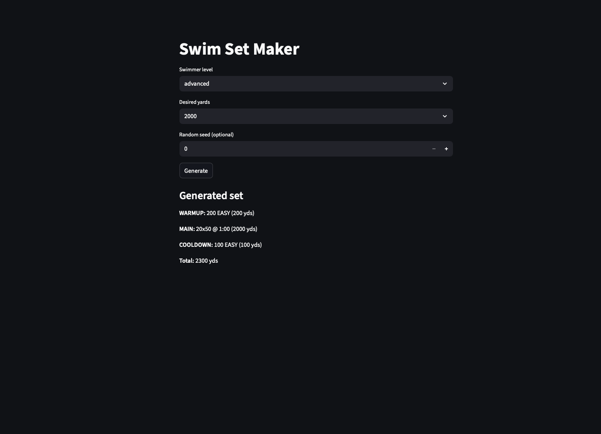

# Swim Set Maker



Generate swim sets (warmup, main, cooldown) from simple building blocks.

Features
- Simple CLI with interactive and non-interactive modes
- Streamlit demo UI (`app.py`)
- Deterministic generation via `--seed`

Quick start

Clone and install dependencies:

```bash
git clone https://github.com/DanV27/swim-set-maker.git
cd swim-set-maker
python3 -m venv .venv
source .venv/bin/activate
pip install -r requirements.txt
```

Run the CLI (interactive):

```bash
python3 main.py
```

Run non-interactive (example):

```bash
python3 main.py --level intermediate --yards 1000 --seed 42
```

Run the Streamlit UI:

```bash
streamlit run app.py
```

Files
- `main.py` - CLI and generator
- `data.py` - warmups, main sets, drills, and cooldowns
- `app.py` - minimal Streamlit UI
- `requirements.txt` - Python deps for the UI

Contributing

Open an issue or PR for desired improvements (more data variations, smarter splitting, tests).

License

MIT